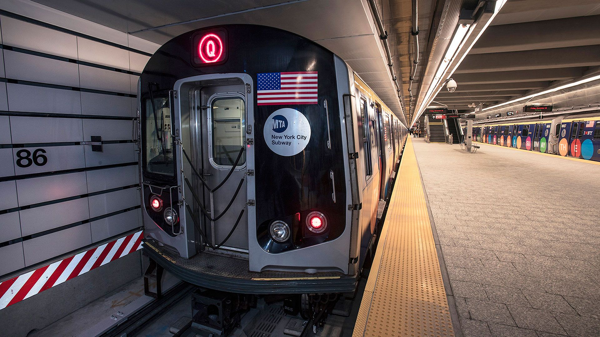

# 🗽 Post-Pandemic MTA Ridership: A Data-Driven Recovery Analysis & Forecasting

  

## Project Overview
This project performs a comprehensive analysis of the New York Metropolitan Transportation Authority (MTA) ridership data from the onset of the COVID-19 pandemic (March 2020) to the present. The goal was to quantify the recovery gap, identify shifts in commuting patterns (Weekday vs. Weekend), and forecast the timeline for returning to pre-pandemic ridership levels.

The entire process demonstrates end-to-end analytical capability, including data cleaning, feature engineering using SQL, advanced DAX modeling, and visual storytelling in Power BI.

---

## Key Questions Answered
1.  **Recovery Status:** How has the Percentage of Pre-Pandemic Day (PPD) evolved across all major services (Subway, Bus, LIRR, Metro-North)?
2.  **Structural Shift:** Has leisure/weekend travel recovered faster than traditional weekday commuting? (Answered via engineered `DayType` feature).
3.  **Gap Quantification:** What is the absolute volume (in riders) of the remaining recovery gap? (Answered via engineered `BASELINE_EST` feature).
4.  **Forecasting:** Based on current trends, when is the projected recovery date for Subway ridership?

---

## 🛠️ Technology Stack
* **Database:** SQLite / DB Browser for SQLite (for data preparation and storage)
* **Data Cleaning & Engineering:** SQL (T-SQL/SQLite Dialect)
* **Visualization & Analysis:** Power BI Desktop
* **Advanced Modeling:** DAX (for custom measures like Baseline Estimation and Gap Volume)

---

## 📊 Core Analysis & Visualizations
The final Power BI dashboard is organized into three key pages, each telling a distinct story:

### 1. The New Normal: Structural Shift Analysis
* **Visual:** Clustered Column Chart comparing **Average PPD** by `DayType` (Weekday vs. Weekend).
* **Insight:** Visually proves that **Weekend recovery has consistently outpaced Weekday recovery**, indicating a permanent shift away from the 9-to-5 commute model.

### 2. The Recovery Race & Forecasting
* **Visual:** Multi-series Line Chart comparing **Average PPD** for Subway, Bus, LIRR, and Metro-North, showing a **Constant Line at 100%**.
* **Insight:** Highlights the **Great Divergence** where commuter rail (LIRR/MN) lags urban transit (Subway/Bus). Includes a **Forecast** to project the recovery timeline for the Subway system.

### 3. Gap Analysis & Financial Impact
* **Visual:** Line/Area Chart comparing **Actual Ridership (`SUB TER`)** vs. **Estimated Baseline Ridership (`SUB_BASELINE_EST`)**.
* **KPI:** A prominent Card Visual displaying the **Total Missing Riders** volume (a custom DAX measure: `SUM(BASELINE) - SUM(ACTUAL)`), quantifying the financial scale of the recovery challenge.

---

## 🧹 Data Preparation & Feature Engineering (SQL Steps)
The raw data required significant cleanup before analysis. The following key steps were performed using SQL:

1.  **Data Type Enforcement:** Explicitly cast all ridership and percentage fields from `TEXT` to `INTEGER` or `REAL` to ensure accurate arithmetic in Power BI.
2.  **Missing Value Handling:** Blanks and non-numeric values were converted to `NULL` to prevent errors.
3.  **Date Feature Engineering:** Created `DayOfWeek` and `DayType` columns using `strftime()` functions.
4.  **Baseline Estimation:** Created the core analytical feature, `[SERVICE]_BASELINE_EST`, by inverting the PPD calculation:
    $$\text{Baseline} = \frac{\text{Actual Ridership (TER)}}{\text{PPD} / 100}$$

---

## 🔗 Live Report and Files
* [Link to Live Power BI Report (Optional: Publish to Web)]
* **Cleaned Dataset:** [`MTA_Ridership_Cleaned_Final.csv`](MTA_Ridership_Cleaned_Final.csv)
* **Power BI File:** [`MTA_Ridership_Analysis.pbix`](MTA_Ridership_Analysis.pbix)
